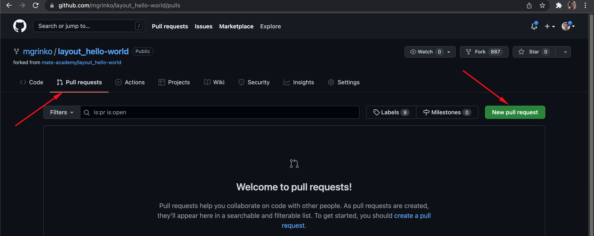
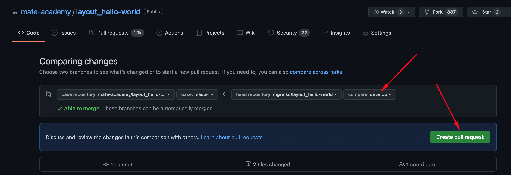
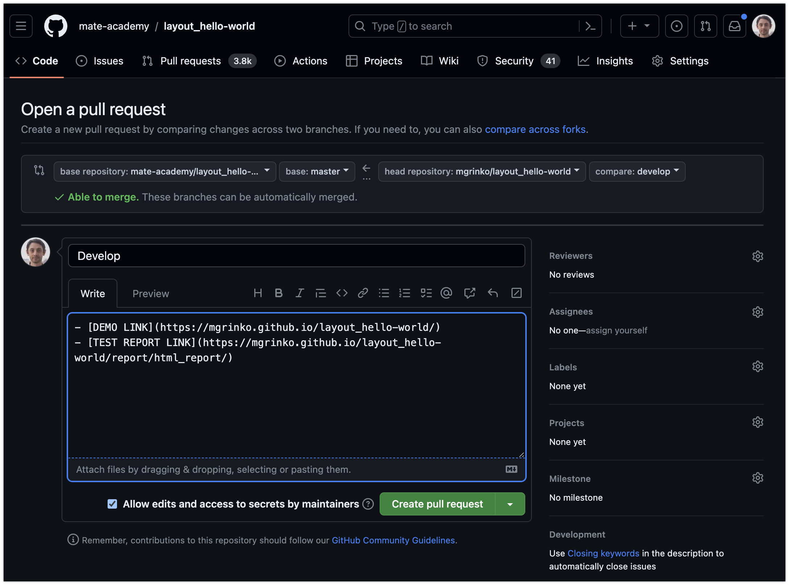

# How to solve the layout tasks on Github

> Learn [Useful GIT commands](https://mate-academy.github.io/fe-program/tools/git/useful-commands)

> Learn [Terminal commands](https://mate-academy.github.io/fe-program/tools/terminal/useful-commands)

## !!!!!!!!! MUST READ !!!!!!!

- to avoid permissions issues **DO NOT place your projects folder on desktop**;
- there should be **NO SPACES in the path**. e.g. `C:\Users\Your Name\projects`;
- it is better to put repositories into `D:\projects` or `C:\Users\YourName\projects` on Windows, or `/Users/YourName/projects` on MacOS.

## If you need to debug tests
[Open this DOC](layout-tests.md)

## Before implementing the first task on Github

- Open your profile page on [the MA Platform](https://mate.academy/profile)
- Scroll down and press `Connect` button next to Github
- Confirm Mate academy app authorization

## Follow these instructions for all HTML/CSS tasks on Github:

### 1. Open the task on the MA platform
- click `Make a fork` button
- it will open the task repo page on Github

### 2. **Fork** the repo


### 3. You should see your name in the URL instead of "mate-academy"


#### To check if the MA Platform sees the forked repo
- Go back to the task on the MA platform
- Reload the page
- The button should change to `Open the task`
- Get back to the forked repo on Github

#### If you need to delete a forked repo
<details>
  <summary>
    Click here to see the instructions</summary>

  - Open project settings 
  - Delete the repo 
</details>

### 4. **Clone** the forked repo
- click the green `Code` button;
- select `HTTPS` tab;
- ensure that link contains your Github name (NOT `mate-academy`)
- copy the link;
- open **Git Bash** (Windows) or **ZSH** (macOS) in your projects folder;
- run `pwd` in the terminal to check that you are in the `projects` folder;
  - if not, navigate to it using the `cd` command with a required path;
- clone the repo by running `git clone` command with the URL you copied on Github
    ```
    git clone the-link-from-github
    ```
    


<details>
  <summary>
    How to open Git Bash</summary>

  
</details>

<details>
  <summary>
    How to paste the project URL to Terminal (Git Bash)</summary>

  
</details>

### 5. Open the project in IDE
- run `code layout_hello-world` in the terminal;
- you will see the project name as a root folder name in VSCode;


<details>
  <summary>
    Project is opened WRONG</summary>

  
</details>

### 6. Open the Terminal in your IDE
- Use the shortcut ``ctrl + ` `` (Windows) or ``cmd + ` `` (MacOS)
- Check if you are inside the project (The project name is the last part in the terminal)
- Check if the terminal in VSCode is Git Bash (Windows) of ZSH (macOS)

<details>
 <summary>
    Click here to see how select the default terminal in VSCode</summary>

 - Choose `Select default shell` option 
 - Select Git Bash (Windows) or zsh (macOS) 
 - Close all the opened terminals
 - All the new terminals will be Git Bash (or zsh)
</details>

### 7. Run `npm install` (or just `npm i`).
And wait until it downloads all the packages and finish.

> Note: You should run it once for every new task

<details>
 <summary>
    If you don't have Node.js</summary>

 
</details>

<details>
 <summary>
    If you run `npm i` outside the project</summary>

 
</details>

<details>
 <summary>
    If you have Node.js 15 or later</summary>

 
</details>

<details>
 <summary>
    How to reinstall Node.js</summary>

 - Open `Add and remove programs` 
 - Uninstall Node.js 
 - Download and install Node.js https://nodejs.org/download/release/v14.16.1/ 
 - Delete `node_modules` 
 - Run `npm i` again 
</details>

### 8. Run `npm start` to check if it works

The command in the terminal will never finish.

- The command should open your browser at `http://localhost:8080/` opened.
- At this point you should see the starting markup of the page.
- If the page is empty add some text to the `<body>` in the `src/index.html` file.
- The text should appear in the browser.

<details>
 <summary>
    If the page is still empty after you added some text</summary>

 - Update the page by pressing `ctrl + r` (`cmd + r` for macOS)
 - If the page is still empty check if you saved the changes 
 - Enable autosave 
</details>

<details>
 <summary>
    If the page is opened at the other port (not :8080)</summary>

 - If you see the other port 
 - It means you already have another terminal running `npm start` command (maybe it is another project)
 - Stop the `npm start` command in current terminal by pressing `ctrl + c` (all operating systems)
 - Close the other terminal running `npm start`
 - Run the command again for your current project
 - The URL should be now `http://localhost:8080/`
 - If the URL is still wrong, just restart the computer
</details>

### 9. Open one more terminal for the next steps.

Use `+` or just press ``ctrl + shift + ` `` or ``cmd + shift + ` ``.


### 10. Create the `develop` branch
Run:
```
git checkout -b develop
```
or
```
git switch -c develop
```

<details>
  <summary>
    If you see that "develop" branch already exists</summary>

  
  - run `git branch` to see all existent branches 
  - If `develop` is marked with `*` then everything is correct
  - Otherwise, run `git checkout develop` (without `-b` key) 
</details>

### 11. Update `DEMO LINK` and `TEST REPORT LINK`
- open `readme.md` file
- replace the text `<your_account>` with your Github username in the `DEMO LINK` and `TEST REPORT LINK`


### 12. Implement the task described in the `readme.md`. 

You should write the code in `index.html` and other files inside `src` folder.

### 13. Check the code style
Run:
```
npm run lint
```

<details>
  <summary>
    If you have some errors</summary>

  - Fix all the errors and run the command again

  
</details>

<details>
  <summary>
    How to find the lines with linter errors</summary>

  
</details>

<details>
  <summary>
    This error means you need to fix CRLF</summary>

  

  - run `git config --global core.autocrlf false`
  - and fix the CRLF in all the files you changed

  
</details>

<details>
  <summary>
    How to fix autoformatting in VSCode</summary>

  - Here is [the documentation](https://code.visualstudio.com/docs/languages/html#_formatting) 
  - Run `Alt + Shift + F` to format the document

  
  
</details>

### 14. Check if your solution matches all the expectations
- read the `checklist.md`;
- fix your code;
- run the tests;
    ```
    npm test
    ```
- Test results should be openned in browser;
- If not, check if you fixed all the code style errors (`npm run lint`)

> If you can't run tests for some weird reason just use a screenshot from
  `backstop_data/bitmaps_reference/Entire_document.png` to ensure your page looks as expected.

#### If you see a failing test

Fix you HTML and CSS to make your page identical to the expected result.


#### If you see ERR_CONNECTION_REFUSED


- check if you have another terminal tab running `npm start` command;
- Open new terminal tab and run `npm start`;
- Check if the page is opened at `http://localhost:8080/`;
- Run `npm test` again to see the results.

### 15. Prepare your changed files for saving
```
git add ./src
```
- Don't add irrelevant files at this point, like `package-lock.json` or test snapshots.
- You can always check which files were changes or added using `git status` command.
- Also don't forget to add readme.md file.
```
git add readme.md
```

### 16. Save your changes

Run the `commit` with a message describing what this code does.

```
git commit -m 'add task solution'
```

<details>
  <summary>
    
    fatal: unable to auto detect email address
  </summary>

  - it means you forgot to configure you GIT name and email
  - See the commands above the error message and run them one by one with your email and name

  
  
</details>

<details>
  <summary>
    no changes added to commit</summary>

  
</details>

<details>
  <summary>
    LF will be replaced with CRLF</summary>

  - You forgot to fix CRLF 

  
</details>

### 17. Send your code to Github
Run:
```
git push origin develop
```

<details>
  <summary>
    failed to push some refs</summary>

  
  

  - Commit changes again after creating `develop` branch 
</details>

<details>
  <summary>
    If you are asked for the Authorization</summary>

  
  
  
</details>

<details>
  <summary>
    fatal: unable to access</summary>

  
  
</details>

### 18. Publish your site to GitHub pages.
Run:
```
npm run deploy
```

> If you are getting some errors run `npm run deploy -- -l` to see more details

Deploy process requires some time to prepare your page on Github after the command is finished.

To check if the page was deployed succesfully you need to check in the project settings on Github:
- Open the forked repo on Github;
- Click the `Setting` tab at the top;
- Choose `Pages` section from the panel on the left;
- There should be a link to your public page at the top (the same as your `DEMO LINK` in the `readme.md`)
- If there are no link at the top check if `gh-pages` branch appeared in the repo;
  - If not run `npm run deploy -- -l` to see more details
- Wait for about 2 minutes and reload the `Settings > Pages` again to see the link;
- Open it to see your page.

### 19. Create a Pull Request (PR)
- Select `Pull requsts` tab;
- Click `New pull request` green button;
- Change the `compare` branch  at the right to `develop`;
- Click `Create pull request` button;
- Copy `DEMO LINK` and `TEST REPORT LINK` from `readme.md` to the PR description;
  - Links should contain your Github name (not `mate-academy`)!!!
- Click `Create pull request` button one more time;
- Check that your `DEMO LINK` and `TEST REPORT LINK` work as expected (open the page and test results);
- Check if the task appeared in the table (only for full-time students)





<details>
  <summary>
    Check your DEMO LINK</summary>

  - You forgot to put your Github name into `DEMO_LINK` and `TEST_REPORT_LINK`

  
</details>

<details>
  <summary>
    Check your TEST REPORT LINK</summary>

  - You forgot to run tests before `npm run deploy`

  
</details>

### 20. To update you PR repeat steps 13-18 (no need to create the PR one more time).

> If you need an ADDITIONAL CODE REVIEW, click on re-request button at the PR page.


## Important 
In order to allow us to review your homework - do not close PR and do not open several PR's.
If there is a fork and PR, then any subsequent PR for that fork will be ignored
and it won't be synced to the platform, only the first PR made after the fork will

- If you have closed the PR - reopen it and request mentor review.
- If you can't open the PR - do another fork and create a new PR.

## Linux users
> If you use _linux_ please make sure you adjusted writing permissions to let 
scripts work without `sudo`. Correct permissions mean you don't see errors like
`permission denied` after running commands in terminal.

## NPM commands
- `npm install` installs the project dependencies and runs `postinstall`
  - which create reference files for pixel perfect and tests 
- `npm start` runs the server required for development and tests
- `npm test` runs linter and tests
  - `npm run lint` runs linter (code style check)
  - `npm run test:only` runs pixel perfect tests
- `npm run deploy` publishes the page and test report to `gh-pages` 

## Useful links
- [Useful GIT commands](https://mate-academy.github.io/fe-program/tools/git/useful-commands)
- [Terminal commands](https://mate-academy.github.io/fe-program/tools/git/useful-commands)
- [HTML, CSS styleguide](https://mate-academy.github.io/style-guides/htmlcss.html)
- [Working with figma](./figma.md)
- [Creating a pull request from a fork](https://help.github.com/en/articles/creating-a-pull-request-from-a-fork)
- [HTML, CSS Code Style Rules](html-css-code-style-rules.md)
