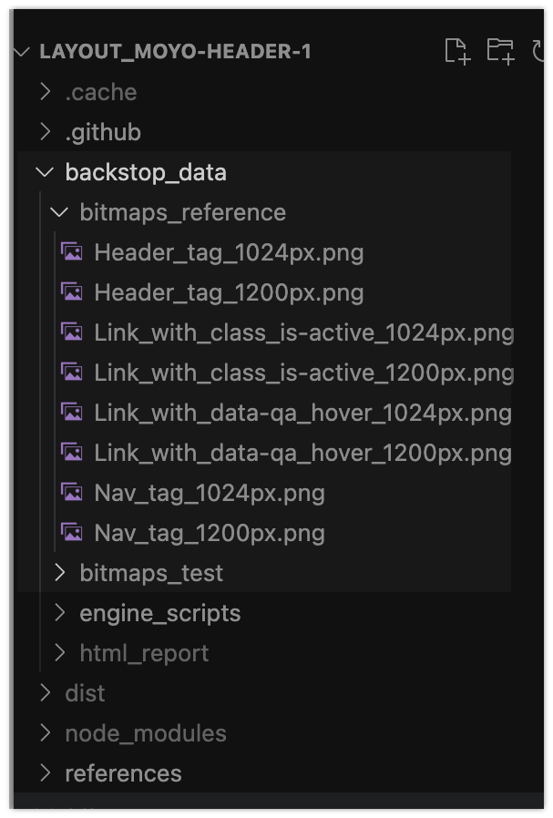
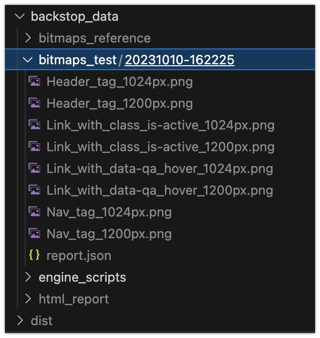
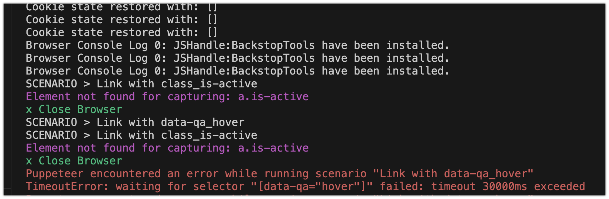
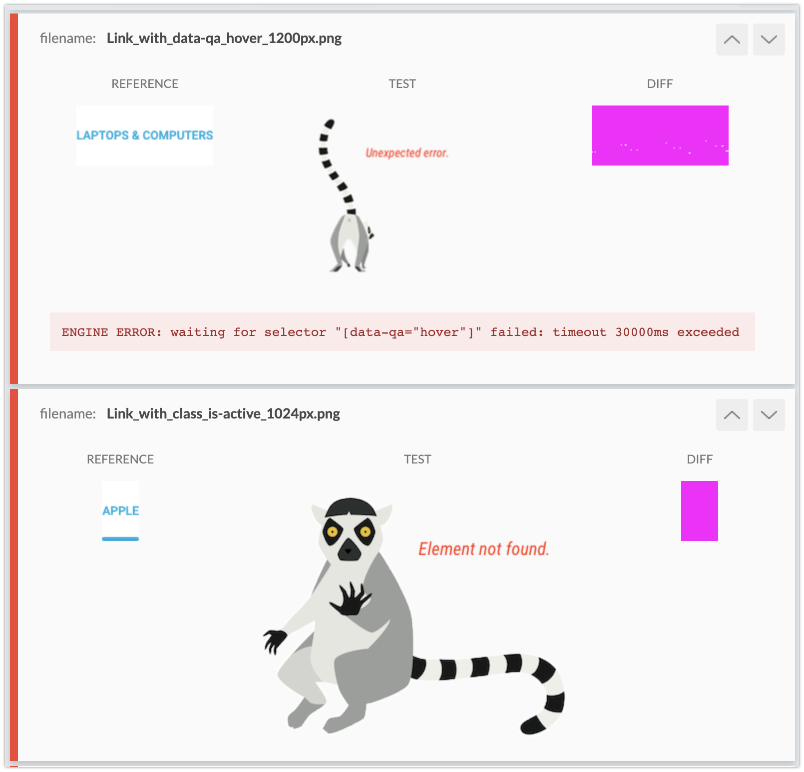

# Layout tests
This document describes how tests work in layout tasks on Github

> For any other problem not related to tests check [THE MAIN DOC](./)

## Prerequisits
- You have Node.js 14 (`node -v`)
- Project is not on the desktop (or in a folder on the desktop)
- Project path does not have spaces or non EN letters
- Dependencies were installed (`npm i`)
- Page is launched in the other terminal (`npm start`)
- You don't have code style error (`npm run lint`)

## Test structure
Tests are described in the `./backstopConfig.js` file. It has 2 important sections:

Viewport defines resolutions that we use for testing:
```js
viewports: [
  {
    name: '1024px',
    width: 1024,
    height: 768,
  },
  {
    name: '1200px',
    width: 1200,
    height: 768,
  },
],
```

Each `scenario` has a `name` that you seen in test results and `selectors` to find an element that will be tested
```js
scenarios: [
  {
    ...basic,
    label: 'Header tag',
    selectors: ['header'],
  },
  {
    ...basic,
    label: 'Nav tag',
    selectors: ['nav'],
  },
  {
    ...basic,
    label: 'Link with data-qa_hover',
    selectors: ['[data-qa="hover"]'],
    hoverSelector: '[data-qa="hover"]',
    postInteractionWait: 1000,
  },
  {
    ...basic,
    label: 'Link with class_is-active',
    selectors: ['a.is-active'],
  },
],
```

Test names will contain `labels` and resolution `names` so you can understand which one fails.

## Running tests
The first time you run tests with `npm test` (or just `npm t`) our test utility creates reference files in the `/backstop_data/bitmaps_reference`:



> If some test file was not created for some reason, just delete the `bitmaps_reference` folder and run `npm t` to create them

And then it opens your page at `http://localhost:8080` to get screenshots of the page you implemented.
They are saved to the `backstop_data/bitmaps_test` folder.



Actual screenshot are compared with the reference pixel by pixel,
and if the difference is really small the test passes.

### Test results

If a test fails you'll see the results page in the browser:


> If result were not open in the browser, read error message in the terminal

> If there are no error messages check `node -v` and `npm run lint`

You can click on a failes test to see its details


- Click the `REFERENCE` button to see the expected result
- Then click the `TEST` button to see your page
- You may zoom in (`ctrl +` or `cmd +`) and toggle between these to buttons to see the difference
- if image jumps it means you have wrong size or placement (`padding`, `margin`, `position`, etc.)
- Change your code and rerun test to see if it helped

### If you see Element not found 



It means you did not add correct `class` or `data-` attribute to some element (check the task description or the selector in `backstopConfig.js`)

### If you see ERR_CONNECTION_REFUSED


It means your page is not awailable at `http://localhost:8080/`.

- Open new terminal tab and run `npm start`;
- Check if the page is opened at `http://localhost:8080/`;
- Run `npm test` again to see the results.

